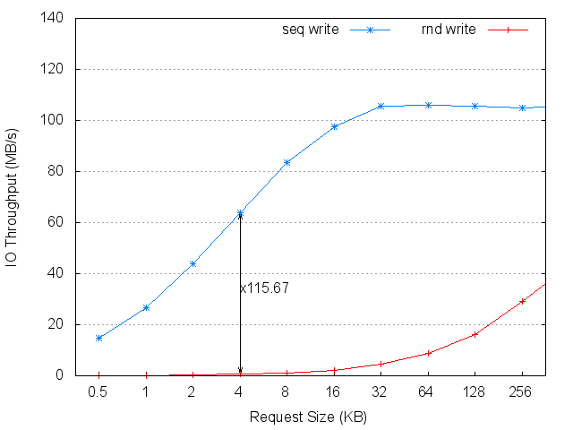
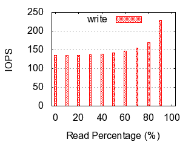

#These are some results tested by [iombench](https://github.com/yongkun/iombench).

__Please note that these results may not represent the optimal performance of measured devices or systems.__ Your results might be different with your configurations.

#Devices

##Hitachi HGST HDS72107 750GB

##Intel X25-E 64GB

##Mtron PRO 7500 32GB

##OCZ Vertex EX 120GB

#Cloud Systems

##AWS EC2 t2.micro

##AWS EC2 i2.xlarge

##Linux Container

##Vsphere VM

#Contact
yongkun at gmail.com

