#Benchmark results by [iombench](https://github.com/yongkun/iombench).

__Please note that these results may not represent the optimal performance of measured devices or systems.__ Your results might be different with your configurations.

**Table of Contents**  *generated with [DocToc](http://doctoc.herokuapp.com/)*

- [Devices](#user-content-devices)
	- [Hitachi HGST HDS72107 750GB](#user-content-hitachi-hgst-hds72107-750gb)
	- [Intel X25-E 64GB](#user-content-intel-x25-e-64gb)
	- [Mtron PRO 7500 32GB](#user-content-mtron-pro-7500-32gb)
	- [OCZ Vertex EX 120GB](#user-content-ocz-vertex-ex-120gb)
- [Cloud Systems](#user-content-cloud-systems)
	- [AWS EC2 t2.micro](#user-content-aws-ec2-t2micro)
	- [AWS EC2 i2.xlarge](#user-content-aws-ec2-i2xlarge)
	- [Linux Container](#user-content-linux-container)
	- [Vsphere VM](#user-content-vsphere-vm)
- [Contact](#user-content-contact)

#Devices

##Hitachi HGST HDS72107 750GB

##Intel X25-E 64GB

Configuration and explanation: [IEICE Yongkun Wang](http://www.tkl.iis.u-tokyo.ac.jp/~yongkun/paper/ieice-yongkun-wang-final.pdf)

### Sequential Throughput
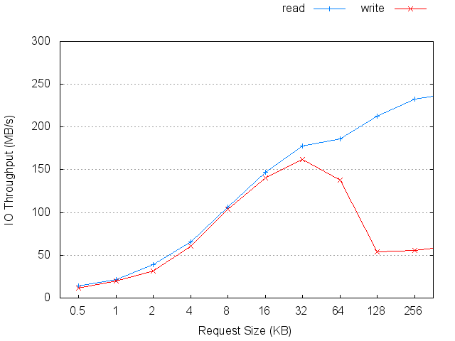
### Random Throughput
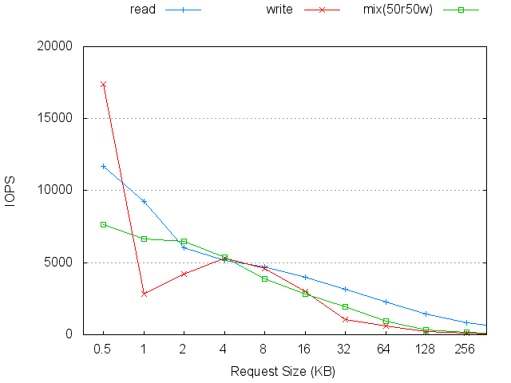
### Random Throughput (30 threads)
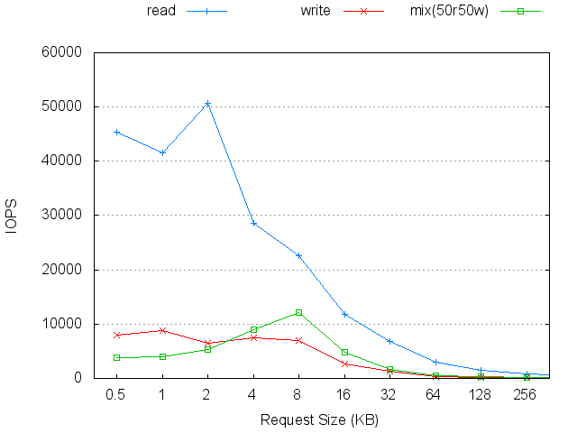
### Sequential Performance with mixed Reads/Writes
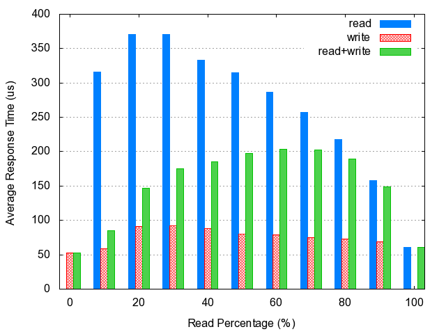
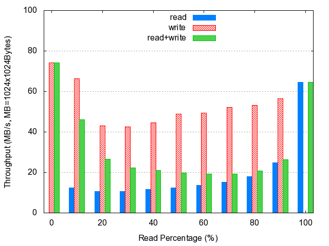
### Random Performance with mixed Reads/Writes
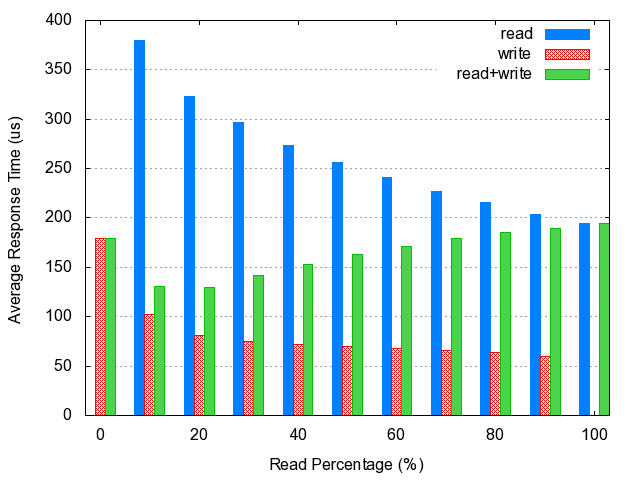
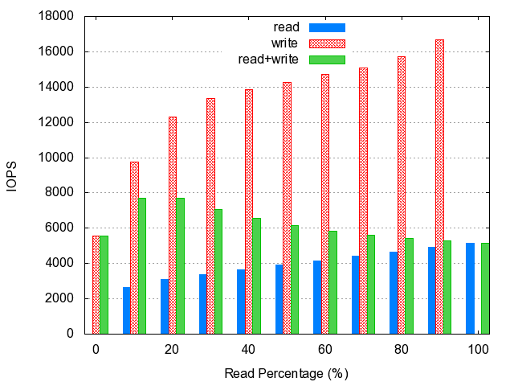

##Mtron PRO 7500 32GB

Configuration and explanation: [IEICE Yongkun Wang](http://www.tkl.iis.u-tokyo.ac.jp/~yongkun/paper/ieice-yongkun-wang-final.pdf)

### Sequential Throughput
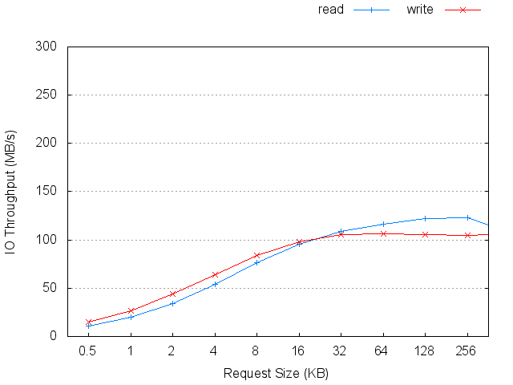
### Random Throughput
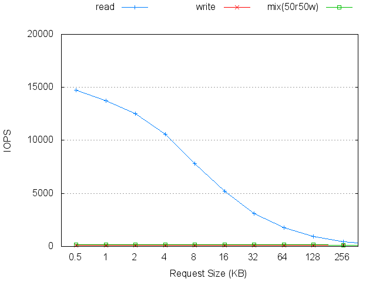
### Random Throughput (30 threads)
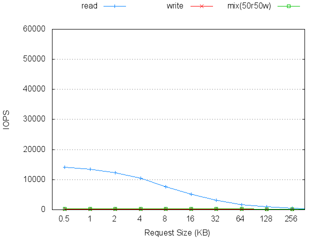
### Sequential Performance with mixed Reads/Writes
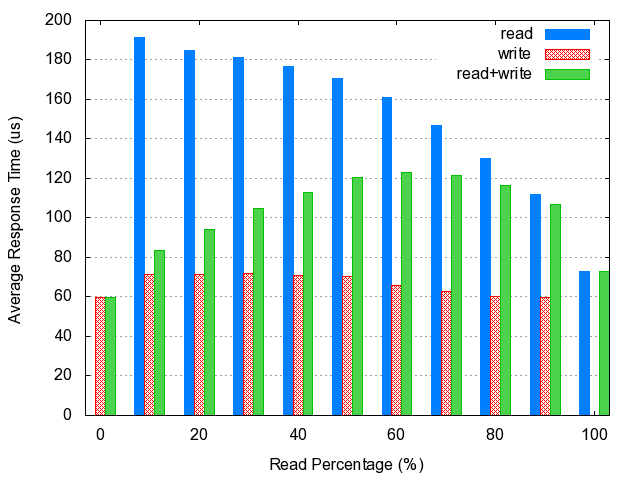
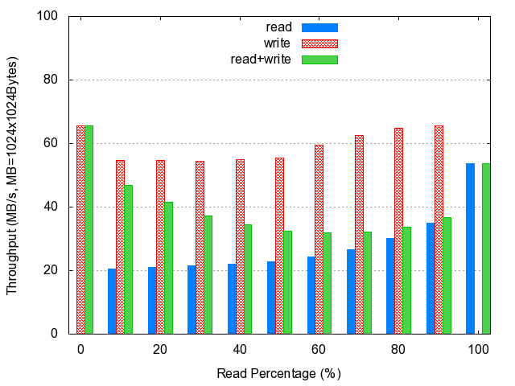
### Random Performance with mixed Reads/Writes
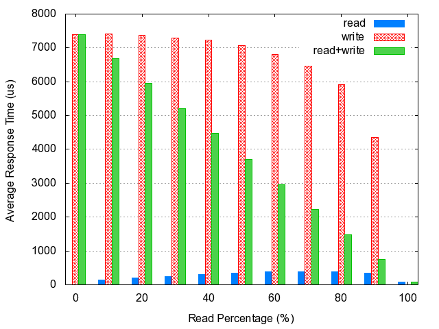
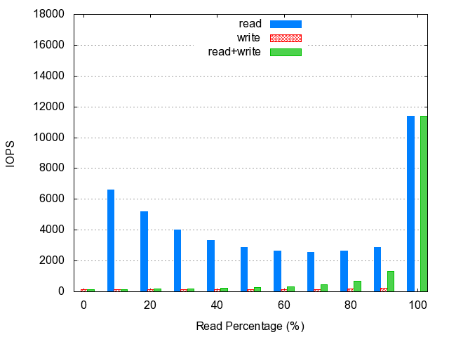

##OCZ Vertex EX 120GB

Configuration and explanation: [IEICE Yongkun Wang](http://www.tkl.iis.u-tokyo.ac.jp/~yongkun/paper/ieice-yongkun-wang-final.pdf)

### Sequential Throughput
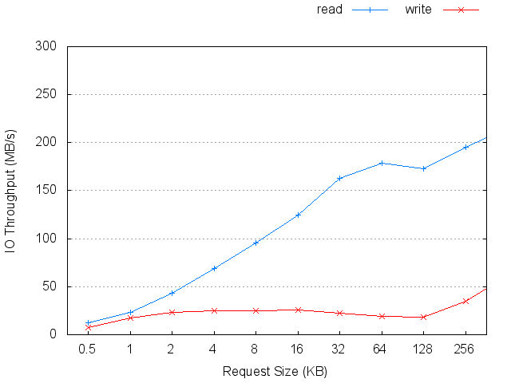
### Random Throughput

### Random Throughput (30 threads)
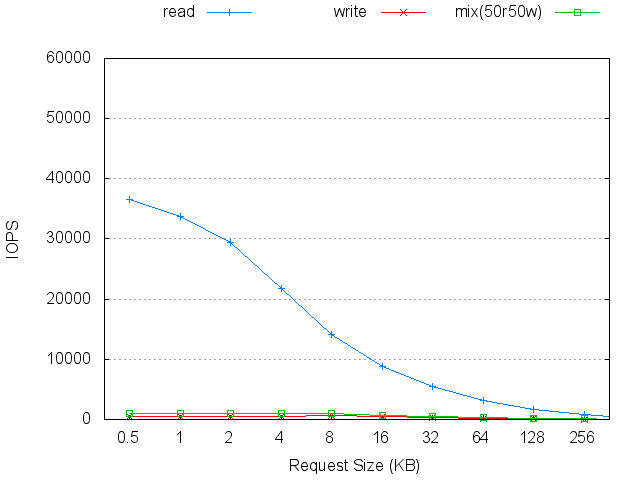
### Sequential Performance with mixed Reads/Writes
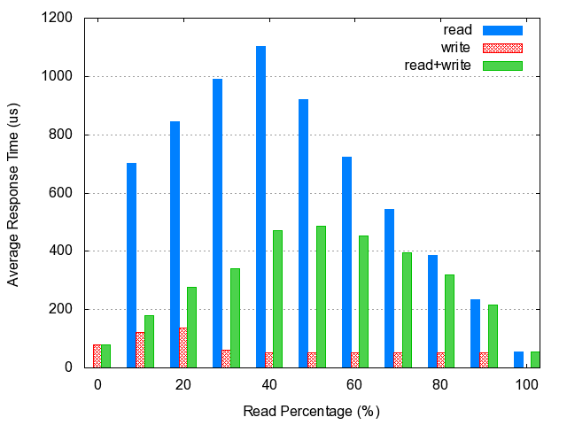
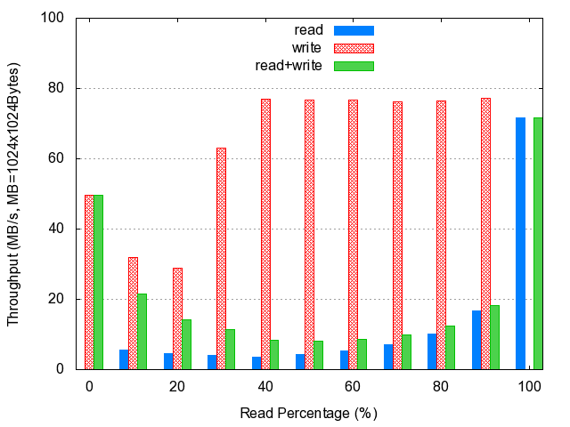
### Random Performance with mixed Reads/Writes
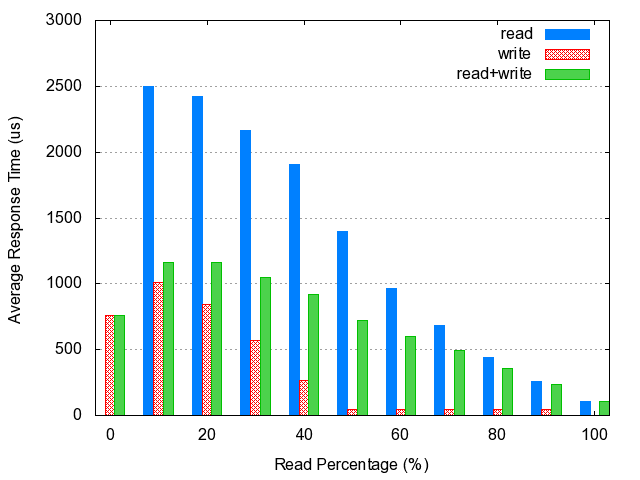
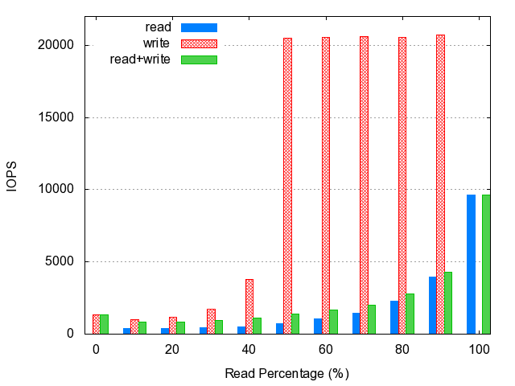

#Cloud Systems

##AWS EC2 t2.micro

##AWS EC2 i2.xlarge

##Linux Container

##Vsphere VM

#Contact
yongkun at gmail.com

